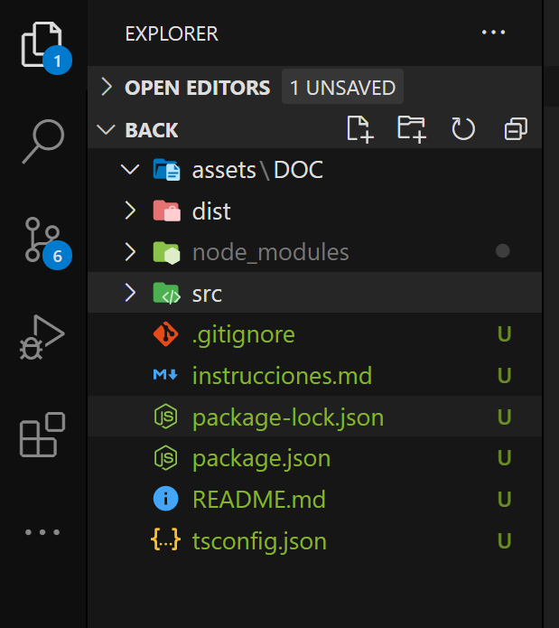

# Pasos a replicar el proyecto - 11/03/21

## Crear API REST

primero se deben instalar las dependencias necesarias para exponer las rutas 

### Dependencias de desarrollo
* @types/express
* @types/cors
* @types/morgan 
* @types/node
* typescript
* tsc-watch
```
npm i @types/cors @types/express @types/morgan @types/node tsc-watch typescript -D
```

### Dependencias de producción 
* cors
* express
* morgan
```
npm i cors express morgan
```
 
Descripción corta de cada paquete

* `"cors"` permite que cualquier url pueda solicitar datos a nuestro servidor [Link para mas info](https://www.npmjs.com/package/cors)

* `"express"` permite crear un servidor minimalista pero poderoso[Link para mas info](https://www.npmjs.com/package/express)

* `"morgan"` permite hacer logs automaticos de las peticiones que se hacen [Link para mas info](https://www.npmjs.com/package/morgan)

* `"typescript"` permite hacer codigo tipado y provee "intellisense" caracteristica que puede reducir los errores de escritura de funciones, metodos, y un monton de cosas mas, no se tu, pero a mi me sirve y me gusta [Link para mas info](https://www.npmjs.com/package/typescript)

* `"tsc-watch"` es una extension de `"typescript"` y permite crear scripts en funcion del resultado de la traduccion de .ts a .js "Sera muy util para no hacer un npm run build para cada cambio ya que es molesto" [Link para mas info]( https://www.npmjs.com/package/tsc-watch)

* `"@types/..." ` son los tipados de cada paquete
___

Despues de instalar las dependencias se iniciara el proyecto en TypeScript, se debe ejecutar el siguiente comando "tsc --init " para hacer un par de configuraciones iniciales, las configuraciones en "tsconfig.json" se van a hacer de forma progresiva de forma que se entienda para que sirve cada cambio en dicho archivo 

### Paso 1

Cambiar de 

`"target": "es5",` a `"target": "es6",`

[LINK DE REFERENCIA A LA DOC](https://www.typescriptlang.org/tsconfig#target)

Esta linea indica que el codigo escrito en TypeScript se convertira a la version de JavaScript mencionada

___

### Paso 2

`"lib": [], ` a  `"lib": ["ES5", "ES6"],`

[LINK DE REFERENCIA A LA DOC](https://www.typescriptlang.org/tsconfig#lib)

Esta línea es de TypeScript 2.0 y hace referencia a las 
características que se usara de JavaScript

___
### Paso 3
de 
```json
"outDir": "./",
"rootDir": "./",
```
a
```json
"outDir": "./dist",
"rootDir": "./src",
```

[LINK DE REFERENCIA DE OUTDIR EN A LA DOC](https://www.typescriptlang.org/tsconfig#outDir)

[LINK DE REFERENCIA DE ROOTDIR EN A LA DOC](https://www.typescriptlang.org/tsconfig#rootDir)

Esta linea hace referencia al path del codigo que escribiremos de TypeScript "./src" y la carpeta "./dist" es la traduccion de TypeScript hacia JavaScript

___

### Paso 4
`"strictPropertyInitialization": true,` a `"strictPropertyInitialization": false,`

[LINK DE REFERENCIA DE ROOTDIR EN A LA DOC](https://www.typescriptlang.org/tsconfig#strictPropertyInitialization)

esta linea hace referencia a que no es obligatorio inizializar una propiedad dentro de una clase 
___

### Paso 5
de `//"moduleResolution": "node",` a `"moduleResolution": "node", `, Notar que se quitaron las "//"

[LINK DE REFERENCIA DE ROOTDIR EN A LA DOC](https://www.typescriptlang.org/tsconfig#moduleResolution)

esta linea hace referencia a una estrategia que aplica TypeScript para el reconocimiento de rutas
___

### Paso 6

Ahora empezaremos a crear la estructura, en la carpeta raiz se debera crear 2 carpetas

``` 
root-|
     |-dist
     |-src
```

En mi editor de código "VS Code" se vería así 



La carpeta "/src" contendra el codigo TypeScript donde escribiremos el codigo, y la carpeta "/dist" sera la traduccion a JavaScript que haga TypeScript "como se explico hace un par te parrafos antes"

Dentro de la carpeta src empezaremos con un archivo index.ts donde iniciaremos el servidor 

```ts
import express from 'express';
import morgan from 'morgan';
import cors from 'cors';

const port = process.env.PORT || 3000;

const app = express();

// middlewares
app.use( cors() );
app.use( morgan('dev') );
app.use( express.json() );

// Init Server
app.listen( port, () => {
    console.log(`Server at http://localhost:${ port }`)
})

```

Bueno, aqui hay varias cositas nuevas, normalmente uno quiere subir la aplicacion node a un hosting y ese hosting expone un puerto para que nosotros podamos hacer que el servidor funcione, pero claro, no queremos cambiar de forma constante entre modo desarrollo y modo produccion, entonces creamos una variable `const port = process.env.PORT || 3000;` y le preguntamos por la variable de entorno PORT, si la tiene es porque esta en el hosting y si no la tiene es porque esta en desarrollo

Despues se crea una nueva instancia de express, se añaden los middlewares desde la nueva instancia, aqui hay un middleware nuevo, ` app.use( express.json() );` se usa para que parsee de forma automatica todas las peticiones que contengan en su cabezera `content-type: application-json`

Para arranzar el servidor existen muchas formas, pero comenzare con la mas molesta porque asi se entendera porque uso la otra

Para correr el servidor se debe ingresar el comando en la raiz del proyecto

`npx tsc`

Despues de que haga la traduccion de .ts a .js ( Suele ser muy rapido ) se debe correr otro comando para arrancar el servidor, ya que TypeScript no es ejecutado por node.

`node dist/index.js`

y debería salir un mensaje como este en consola 
``` 
PS C:\Users\manue\OneDrive\Escritorio\Angular\blog-pyndele\back> node dist/index.js
Server at http://localhost:3000
```

Como vemos estamos usando dos comandos, uno para traducir de .ts a .js y otro para lenvantar el servidor, aqui en donde entra la dependencia de desarrollo `"tsc-watch"`

En el `package.json ` vamos a añadir un par de scripts

``` json
  "scripts": {
    "dev": "tsc-watch --onSuccess \"npm start\" ",
    "start": "node dist/index.js"
  },
```

Ahora tenemos dos scripts, `"start"` para el hosting ( Azure ) donde se subira la app y `"dev"` para nosotros, con `"dev"` el servidor estara pendiente de los cambios en el codigo y ejecutara otro script despues de que la traduccion se haga sin errores  

para correr el script `"dev"` se debe ejecutar el comando

```
npm run dev
```

y responderá con un mensaje parecido a este 

```
7:57:28 a. m. - Starting compilation in watch mode...

7:57:30 a. m. - Found 0 errors. Watching for file changes.

> back@1.0.0 start C:\Users\manue\OneDrive\Escritorio\Angular\blog-pyndele\back
> node dist/index.js

Server at http://localhost:3000
```
Ahora cada ves que se guarden los cambios con `"control + S"` se actualizara el servidor

Agregaremos 2 carpetas al directorio `src` y quedara algo asi

``` 

```

``` 
root-|
     |-dist
     |-src-|
           |-controller
           |-router
```

La carpeta `"router"` se encargara de manejar las rutas y adicionar middleware que se necesiten y la carpeta `"controller"` se encargara de manejar la logica detras de cada ruta

Comenzaremos en la carpeta controller y crearemos un archivo con el nombre `"controller.ts"`

El código en `"controller.ts"` quedaría así:
```ts
import { Request, Response } from 'express';

export const getRoot = async ( req: Request, res: Response) : Promise<Response> => {
 
    return res.send('Hola')
}
```

Ahora las rutas, dentro de la carpeta `"router"` creare un archivo llamado `"router.ts"` para sincronizar las funciones de `"controller.ts"` con las funciones de `"router.ts"`

El código de `"router.ts"` quedaría así:

``` ts
import { Router } from 'express'
import { getRoot } from '../controller/controller';

const router = Router();

router.get(
    /* Nombre de ruta -->*/ '/', 
    [ /* Array de middlewares*/ ],  
    /* Controller -->*/ getRoot 
);

export default router;
```

Ahora hay que decirle a `"express"` que utilize las rutas, normalmente se hace en `"index.ts"`

Y el código se vería así:

``` ts
import express from 'express';
import morgan from 'morgan';
import cors from 'cors';
import router from './router/router';

const port = process.env.PORT || 3000;

const app = express();

// middlewares
app.use( cors() );
app.use( morgan('dev') );
app.use( express.json() );

// Notar que se añadio esta linea
// Router
app.use( router )

// Init Server
app.listen( port, () => {
    console.log(`Server at http://localhost:${ port }`)
})

```
 Y listo, solo toca acceder a la direccion que aparece en la consola  

## Hora de crear rutas GET, POST, PUT, DELET

Antes de crear las rutas vamos a crear el controlador en el archivo `"controller.ts"` para la ruta `"POST"`

el código se vería así

```ts
import { Request, Response } from 'express';

export const getRoot = async ( req: Request, res: Response) : Promise<Response> => {
 
    return res.send('Hola')
}

export const postForm = async ( req: Request, res: Response ) : Promise<Response> => {
        
    const body = req.body;

    return res.json({ 
        body
    })
}
```
